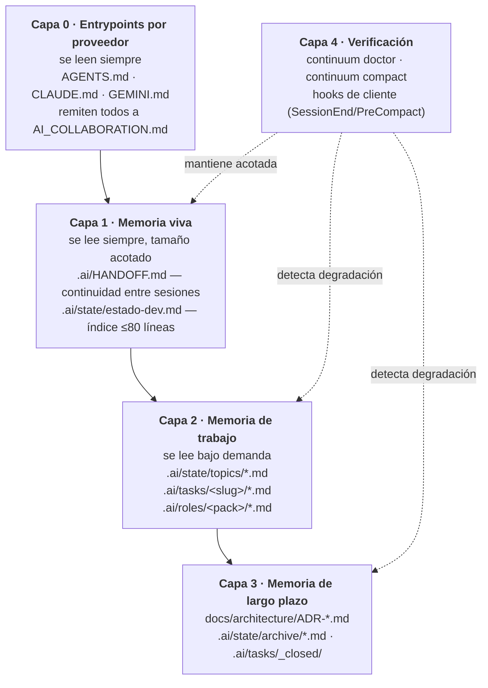
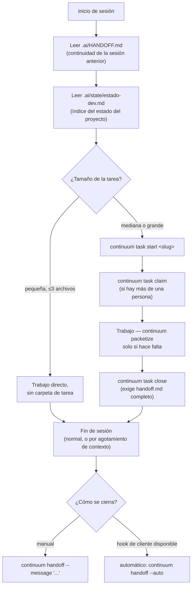

# Diseño de Continuum

Este documento explica las decisiones detrás de lo que hay en `template/`:
qué problema resuelve el sistema, qué se descartó deliberadamente y por qué,
y qué evidencia respalda cada elección.

> **Revisión 2026-09-09.** Después de la primera versión de este diseño se
> realizó una revisión de literatura académica y de práctica de industria
> (`docs/investigacion-2026.md`) que confirmó el rumbo general pero corrigió
> puntos concretos. El diagrama de capas y las secciones de memoria/tokens de
> este documento ya reflejan esa corrección; el detalle de cada cambio y su
> justificación está en `docs/decision-log.md`.

## 1. Origen: auditoría de cinco repositorios de producción

El diseño parte de una auditoría de cinco repositorios de software en
producción activa que ya habían intentado, de forma independiente y con
distinto grado de éxito, resolver el mismo problema. Se referencian aquí de
forma anonimizada como **Proyecto A–E**, caracterizados por lo que aportaron
a este diseño:

| Ref. | Perfil | Aporte principal a este diseño |
|---|---|---|
| A | Protocolo de colaboración con IA maduro, con ADRs y bitácora de decisiones activa | Evidencia de que el patrón "fuente única + entrypoints delgados" sostiene disciplina real a lo largo de varias semanas de desarrollo intenso |
| B | Protocolo declarado pero con herramienta de memoria nunca usada más allá de la instalación inicial | Evidencia de que un sistema documentado sin verificación mecánica se desactualiza en semanas sin que nadie lo note |
| C | El proyecto con mayor volumen de historial acumulado (~90 KB en un único archivo de memoria) | Evidencia del costo de no acotar ni compactar la memoria; también mostró un toolkit de tareas usado intensivamente pocos días y luego abandonado |
| D | Sin ningún mecanismo de memoria o colaboración con IA | Caso base: qué falta reconstruir para una adopción desde cero |
| E | Diseño conceptual más completo de los cinco, sin código de orquestación | Base directa de varias convenciones de este diseño (presupuesto de contexto por tamaño de tarea, plantilla de handoff) |

### Qué ya funcionaba y se conserva

- **Fuente única de verdad + entrypoints delgados por proveedor**
  (`AI_COLLABORATION.md` canónico; `AGENTS.md`, `CLAUDE.md`, `GEMINI.md` como
  remisiones). Evita reglas divergentes entre proveedores de IA.
- **El repositorio como memoria**: toda decisión u observación que importe
  más adelante se escribe en un archivo versionado, no queda solo en una
  conversación.
- **Handoff estructurado**, con campos fijos (objetivo, archivos, decisión,
  validación, siguiente paso): funciona de forma consistente cuando se usa.
- **Presupuesto de contexto por tamaño de tarea** (Proyecto E): leer menos
  para tareas pequeñas, más estructura para las grandes.
- **Fragmentación de archivos extensos** para explorarlos por partes
  (Proyecto C, Proyecto E).

### Fallas recurrentes que este diseño corrige explícitamente

| Falla observada | Dónde | Corrección en este diseño |
|---|---|---|
| Un toolkit de gestión de tareas se usa de forma intensiva unos días y luego se abandona | C, B | Las tareas son **opcionales** por debajo de un umbral de tamaño (§2); solo el handoff es siempre obligatorio |
| Directorios de configuración por proveedor vacíos o sin control de versiones | A, B | `continuum doctor` falla si un proveedor declarado no tiene su archivo de configuración presente y versionado |
| Archivos duplicados que divergen entre sí con el tiempo | D, C, B | `continuum doctor` detecta duplicados por nombre de archivo fuera de los directorios de archivo |
| El archivo de memoria principal crece sin límite (~90 KB en un caso, con secciones internas duplicadas) | C | La memoria es un índice acotado más archivos de tema (§5); `continuum compact` archiva el historial por mes |
| La memoria queda desactualizada durante meses sin que se detecte | B | `continuum doctor` compara la fecha de modificación de la memoria contra la del último commit del repositorio |
| Tareas abiertas sin cerrar ni handoff | C, A | `continuum doctor` marca tareas sin `handoff.md` tras un número configurable de días |
| Ninguna automatización real: el cumplimiento depende de que alguien recuerde seguir el protocolo | Los cinco casos | Hooks de cliente (`SessionEnd`/`PreCompact` en Claude Code) invocan `continuum handoff --auto` sin intervención humana |
| Sin visibilidad del costo en tokens del contexto que se carga por defecto | Los cinco casos | `continuum doctor` estima en tokens el costo del contexto de arranque |

## 2. Principios de diseño

1. **El repositorio es la memoria; la conversación es el canal de
   ejecución.** Principio heredado de los proyectos auditados y base del
   resto del diseño.
2. **La ceremonia debe ser proporcional al riesgo, no a un ideal de
   proceso.** Un cambio de dos líneas no necesita una carpeta de tarea. La
   causa más frecuente de abandono observada en la auditoría fue exigir la
   misma ceremonia a cambios triviales que a features grandes.
3. **Lo que depende solo de la memoria humana no se sostiene.** Una regla de
   proceso sin verificación mecánica deja de cumplirse en semanas (evidencia
   directa: Proyecto B). Por esto existe `continuum`: convierte convención
   en comandos y hooks verificables.
4. **La memoria debe estar acotada, no crecer indefinidamente.** Un archivo
   de memoria sin límite es un costo de tokens que paga cada sesión nueva
   de forma permanente. Todo lo que persiste tiene una estrategia de
   compactación o archivado.
5. **El soporte multi-proveedor debe ser verificable, no solo declarado.**
   Si un proyecto declara soporte para varios proveedores de IA, tiene que
   existir una verificación mecánica de que cada entrypoint existe, está
   versionado y es consistente — no basta con un directorio vacío.
6. **El handoff es el contrato de continuidad y no tiene excepciones.** Es
   la única pieza sin excepción por tamaño de tarea: incluso el cambio más
   pequeño deja constancia de qué se hizo y qué sigue. Es el mecanismo que
   permite cambiar de proveedor de IA o de persona a mitad de una tarea sin
   tener que reconstruir el contexto desde cero.

## 3. Capas del sistema

Una sesión nueva —de cualquier proveedor, de cualquier persona— solo
necesita leer las Capas 0 y 1 para empezar a trabajar; `continuum doctor`
mide ese costo. Las Capas 2 y 3 se exploran bajo demanda, nunca por defecto.

Dentro de la Capa 2, `.ai/roles/<pack>/*.md` es un catálogo de personas que
una sesión adopta para una tarea (frontend, backend, legal, pedagogo,
etc.) — no agentes que corren de forma concurrente (ver ADR-009). Detalle
completo en `AI_COLLABORATION.md` §9.

## 4. Flujo de una sesión

El caso que este diseño prioriza — el agotamiento del contexto disponible a
mitad de una tarea — se cubre con el hook automático: no depende de que el
asistente de IA decida escribir el handoff, se dispara cuando el cliente
detecta el fin de la sesión o la compactación de contexto. En clientes sin
hooks equivalentes, el entrypoint correspondiente instruye ejecutar el
comando manualmente ante la primera señal de agotamiento, y `continuum
doctor` detecta después si el handoff quedó desactualizado.

## 5. Soporte multi-proveedor: alcance real

Este diseño no construye un orquestador que reparta tareas entre
proveedores de IA de forma automática. Ninguno de los cinco proyectos
auditados mostró ese patrón en la práctica — en todos los casos, una
persona alternaba manualmente entre distintos clientes de IA sobre el mismo
repositorio. Construir orquestación automática sería resolver un problema
sin evidencia de necesidad real. Lo que sí forma parte del diseño:

- Un único protocolo y una única memoria que cualquier proveedor compatible
  puede leer y escribir sin traducción.
- Verificación mecánica de que el soporte declarado por proveedor es real
  (§2, principio 5).
- El campo `--provider` en `continuum handoff`, que deja explícito en el
  propio registro qué proveedor trabajó cada parte, de forma que la
  alternancia manual entre herramientas quede auditable.

Si en el futuro surge una necesidad real de concurrencia entre agentes sobre
el mismo repositorio, el punto de extensión natural es `continuum task
claim` (hoy una señal de visibilidad, evolucionable a un mecanismo de
bloqueo) — pero no se construye por adelantado.

## 6. Eficiencia de tokens

- **Lectura mínima por defecto**: Capas 0 y 1 primero; el resto, bajo
  demanda (§3).
- **Memoria acotada de forma activa**: índice de hasta 80 líneas y archivos
  de tema de hasta 300 líneas cada uno (verificado por `continuum doctor`),
  con `continuum compact --topic` para archivar por mes el historial de un
  tema — no un archivo único que crece sin control.
- **`continuum packetize` es un último recurso, no el flujo por defecto**:
  el fundamento técnico de esta capacidad (Recursive Language Models,
  arXiv:2512.24601) propone exploración activa del contexto mediante un
  entorno de ejecución, no fragmentación estática previa — que ya cubren las
  herramientas nativas de lectura por rango y búsqueda de los clientes
  agénticos actuales.
- **Caching de prompts**: el protocolo instruye no modificar el bloque
  estable de contexto (entrypoints, índice de memoria) a mitad de sesión,
  para que los proveedores con caching de prompt puedan reutilizarlo en
  lugar de reprocesarlo en cada turno. Es la única técnica de esta lista que
  depende del cliente o la API utilizada, no del contenido del repositorio.
- **Visibilidad del costo real**: `continuum doctor` estima en tokens cada
  archivo de carga obligatoria y el total, de forma que la decisión de
  compactar se tome con datos.

## 7. Trabajo en equipo

- Visibilidad de quién trabaja qué: `continuum task claim`.
- Trazabilidad sin infraestructura adicional: prefijo `[slug]` en los
  mensajes de commit, consultable con `git log --grep`.
- Aislamiento de trabajo concurrente mediante `git worktree` por tarea
  activa cuando dos personas o agentes trabajan el mismo repositorio al
  mismo tiempo — complementa a `continuum task claim`, que da visibilidad
  social pero no aísla archivos en disco.
- Sin bloqueos duros ni almacenamiento compartido adicional: git ya resuelve
  conflictos de contenido; este diseño añade únicamente la señal social que
  a git le falta.

## 8. Fuera de alcance (decisión deliberada)

- **Orquestación real entre agentes de IA** — sin evidencia de necesidad en
  los casos auditados (§5).
- **Memoria vectorial o basada en embeddings** — para el volumen de los
  proyectos auditados, texto plano con búsqueda por patrones y fragmentación
  bajo demanda es suficiente, y evita una dependencia de infraestructura que
  todo proveedor tendría que poder leer por igual.
- **Verificación en CI que bloquea el merge** — la plantilla incluye el
  workflow como no bloqueante por defecto (`continue-on-error: true`); cada
  equipo puede activarlo una vez que confíe en la ausencia de falsos
  positivos en su flujo real.
- **Bloqueos reales sobre tareas** — con un operador principal por proyecto,
  que fue el patrón observado en los cinco casos, un bloqueo real es
  sobre-ingeniería; queda como punto de extensión, no como parte del diseño
  inicial.

## 9. Distribución

Ver `README.md` para el mecanismo de distribución (`git subtree`) y
`docs/rollout-guide.md` para el procedimiento de adopción en un proyecto ya
existente.
