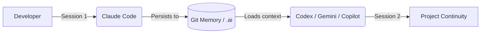

<div align="center">

# Continuum

**Git-backed persistent memory protocol and CLI tools for teams working with multiple AI assistants.**

[](CHANGELOG.md)
[](https://github.com/mikeroguez/continuum/actions/workflows/continuum-doctor.yml)
[](https://github.com/mikeroguez/continuum/actions/workflows/tests.yml)
[](LICENSE)

[Leer en español](README.md) · [Language Policy](docs/LANGUAGE_POLICY.en.md) · [Manual for People](template/docs/using-continuum.md) · [Guide for Agents](template/docs/guide-for-agents.md)

---

</div>

## What is Continuum?

**Continuum** is a lightweight Git-native framework designed to **persist software project context directly within the repository**, eliminating reliance on volatile AI chat history.



### Core Principles

- **Universal Interoperability**: Fully compatible with the [`AGENTS.md`](https://agents.md) convention and native adapters for **Claude Code, Codex, Gemini CLI, and GitHub Copilot** (VS Code, Copilot Coding Agent, GitHub.com).
- **Lossless Continuity**: Work sessions resume seamlessly across token limits, provider rotations, or developer handoffs.
- **Multi-Agent Collaboration**: Developers and AI assistants collaborate in parallel without overwriting or stepping on code.
- **Context Cost Optimization**: Startup context stays in the low thousands of tokens per session instead of tens of thousands of tokens of bloated chat logs — an exact, verifiable figure for your own project via `continuum doctor`, never a marketing estimate.
- **100% local, no dependencies**: the CLI is pure Python (standard library only), makes no calls to any external service, and collects no telemetry — your code and decisions never leave the repository.

---

## Quickstart

> [!TIP]
> **Clean Distribution (Linear Vendoring):**
> Continuum is installed into `.continuum/` keeping your project's Git history 100% clean and linear (no synthetic orphan commits or merge clutter).

### 1. Install into an existing project

```bash
# Download Continuum into .continuum/ via clean vendoring (recommended)
mkdir -p .continuum
git fetch https://github.com/mikeroguez/continuum.git export
git archive FETCH_HEAD | tar -x -C .continuum/

# Initialize configuration, entrypoints, and githooks
python3 .continuum/tools/continuum init

# Commit cleanly to your repository (1 clean commit)
git add -A && git commit -m "chore: install Continuum"
```

*(Optional: If you prefer `git subtree`: `git subtree add --prefix=.continuum https://github.com/mikeroguez/continuum.git export --squash` followed by `python3 .continuum/tools/continuum init`)*

### 2. Verify Health

```bash
tools/continuum doctor
```

---

## Key Components

| Component | Path | Purpose | When to read |
| :--- | :--- | :--- | :--- |
| **Canonical Protocol** | [`AI_COLLABORATION.md`](AI_COLLABORATION.md) | Single authoritative workflow rules | At the start of every session |
| **Immediate Handoff** | [`.ai/HANDOFF.md`](.ai/HANDOFF.md) | Summary of recent state, tests, and next steps | When starting or resuming work |
| **Memory Index** | [`.ai/state/estado-dev.md`](.ai/state/estado-dev.md) | Compact project memory map (<80 tokens) | At session startup |
| **Topic Modules** | `.ai/state/topics/` | Structured breakdowns (architecture, decisions, pending) | On-demand as needed |
| **CLI Engine** | [`tools/continuum`](tools/continuum) | Diagnostics, tasks, sync, and metrics | Via terminal CLI |

---

## CLI Command Reference (`tools/continuum`)

### Diagnostics and Session
```bash
tools/continuum                        # doctor: Run full diagnostic checks
tools/continuum --version              # Installed version (or 'continuum version')
tools/continuum session start          # Start session: load handoff, active tasks, and context
tools/continuum session end --auto     # End session: perform linting and write handoff
tools/continuum status                 # Display compact status and recommended action
```

### Task Management (`task`)
```bash
tools/continuum task start <slug> --size small|medium|large   # Create scoped task
tools/continuum task claim <slug> <owner>                    # Declare task ownership
tools/continuum task close <slug>                           # Close and archive task
```

### Synchronization & Channels (`sync`)
```bash
tools/continuum sync                       # Diagnostics and update plan
tools/continuum sync --apply               # Clean update of .continuum/ (vendoring mode)
tools/continuum sync --channel dev --apply # Switch to development channel (export-develop)
tools/continuum sync --version v1.5.0      # Pin a specific release version by tag
tools/continuum install-hooks              # Install local pre-commit githook
```

### Uninstall
```bash
tools/continuum uninstall                                    # Uninstall plan (dry-run, deletes nothing)
tools/continuum uninstall --no-dry-run                        # Removes the CLI, generated subagents, and its own hooks
tools/continuum uninstall --no-dry-run --yes                  # + entrypoints, config, and role catalog
tools/continuum uninstall --no-dry-run --yes --purge-memory   # + .ai/HANDOFF.md, .ai/state/, .ai/tasks/
```
Three increasing safety tiers — never commits on its own, never touches
`docs/architecture/` (a project's own ADRs live there).

---

## Git Safety & Integrity

> [!IMPORTANT]
> **No history pollution:**
> With default **Linear Vendoring**, updates to `.continuum/` do not create orphan roots or synthetic merge commits. Your Git commit graph stays 100% clean, linear, and professional.

---

## Documentation

- [Manual for People and Teams](template/docs/using-continuum.md) — Adoption guide, team use cases, and prompt templates.
- [Conduct Guide for AI Agents](template/docs/guide-for-agents.md) — Directives and operational boundaries for assistants.
- [Assisted Review](template/docs/copilot-code-review.md) — Review criteria
  without replacing human approval.
- [Architecture Decision Records (ADRs)](docs/decision-log.md) — Continuum technical decision history.
- [Contributing Guide](CONTRIBUTING.en.md) — Guidelines for commits, Pull Requests, and SemVer releases.

---

<div align="center">

Continuum is maintained by [Mike Roguez](https://mikeroguez.me) under the [MIT License](LICENSE).

</div>
