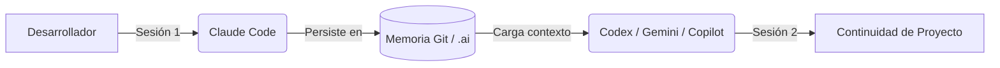

<div align="center">

# Continuum

**Protocolo y herramientas de memoria persistente para equipos que trabajan con múltiples asistentes de IA sobre el mismo repositorio Git.**

[](CHANGELOG.md)
[](https://github.com/mikeroguez/continuum/actions/workflows/continuum-doctor.yml)
[](https://github.com/mikeroguez/continuum/actions/workflows/tests.yml)
[](LICENSE)

[Read in English](README.en.md) · [Política de Idiomas](docs/LANGUAGE_POLICY.md) · [Manual para Personas](template/docs/como-usar-continuum.md) · [Guía para Agentes](template/docs/guia-para-agentes.md)

---

</div>

## ¿Qué es Continuum?

**Continuum** es una infraestructura ligera basada en Git para **persistir el contexto vivo de un proyecto de software directamente en el repositorio**, eliminando la dependencia del historial volátil del chat con asistentes de IA.



### Principios Clave

- **Interoperabilidad Universal**: Compatible con la convención [`AGENTS.md`](https://agents.md) y adaptadores nativos para **Claude Code, Codex, Gemini CLI y GitHub Copilot** (VS Code, Copilot Coding Agent, GitHub.com).
- **Continuidad sin Pérdidas**: Las sesiones se interrumpen por límite de tokens o cambio de proveedor sin perder el avance ni las decisiones.
- **Colaboración Multi-Agente**: Desarrolladores y asistentes trabajan en paralelo sobre el mismo repositorio sin sobrescribir ni pisar código.
- **Optimización de Contexto**: El arranque de cualquier sesión consume solo unos pocos miles de tokens fijos frente a historiales inflados de chat — cifra exacta y verificable en tu propio proyecto con `continuum doctor`, nunca un estimado de marketing.
- **100% local, sin dependencias**: el CLI es Python puro (solo librería estándar), no llama a ningún servicio externo y no recolecta telemetría — tu código y tus decisiones nunca salen del repositorio.

---

## Inicio Rápido

> [!NOTE]
> **Distribución recomendada vía `git subtree`:**
> Se incorpora como plantilla base utilizando `git subtree` para mantener el proyecto limpio y sincronizable de forma permanente.

### 1. Instalar en un proyecto existente

```bash
# Agregar el remoto de Continuum (una sola vez)
git remote add continuum https://github.com/mikeroguez/continuum.git

# Montar la plantilla en la raíz usando la rama export
git subtree add --prefix=. continuum export --squash -m "chore: instala Continuum v1.5.0"
```

### 2. Configurar e Inicializar

```bash
# Configurar los datos del proyecto en .ai/config.json
$EDITOR .ai/config.json

# Instalar githooks locales y verificar estado
tools/continuum install-hooks
tools/continuum doctor
```

---

## Piezas Principales del Protocolo

| Componente | Ruta | Propósito | Cuándo se lee |
| :--- | :--- | :--- | :--- |
| **Protocolo Canónico** | [`AI_COLLABORATION.md`](AI_COLLABORATION.md) | Reglas operativas únicas y obligatorias | En el arranque de cada sesión |
| **Continuidad Inmediata** | [`.ai/HANDOFF.md`](.ai/HANDOFF.md) | Resumen del último estado, pruebas y siguientes pasos | Al iniciar/retomar trabajo |
| **Índice de Memoria** | [`.ai/state/estado-dev.md`](.ai/state/estado-dev.md) | Mapa ligero de memoria del proyecto (<80 tokens) | Al arrancar |
| **Temas Específicos** | `.ai/state/topics/` | Desglose modular (arquitectura, decisiones, pendientes) | Bajo demanda |
| **Motor CLI** | [`tools/continuum`](tools/continuum) | Diagnóstico, tareas, sincronización y métricas | Vía terminal |

---

## Referencia del CLI (`tools/continuum`)

### Diagnóstico y Sesión
```bash
tools/continuum                        # doctor: Diagnóstico completo del estado del proyecto
tools/continuum --version              # Versión instalada (o 'continuum version')
tools/continuum session start          # Inicio de sesión: lee handoff, tareas y sugiere contexto
tools/continuum session end --auto     # Cierre de sesión asistido con validación de calidad
tools/continuum status                 # Estado compacto y siguiente acción recomendada
```

### Gestión de Tareas (`task`)
```bash
tools/continuum task start <slug> --size small|medium|large   # Crear tarea acotada
tools/continuum task claim <slug> <responsable>              # Declarar ownership
tools/continuum task close <slug>                           # Cerrar y archivar tarea
```

### Sincronización y Actualizaciones (`sync`)
```bash
tools/continuum sync --apply           # Sincronizar plantilla con el repositorio remoto
tools/continuum install-hooks          # Instalar pre-commit githook local
```

### Desinstalación
```bash
tools/continuum uninstall                              # Plan de desinstalación (dry-run, no borra nada)
tools/continuum uninstall --no-dry-run                  # Retira el CLI, subagentes generados y hooks propios
tools/continuum uninstall --no-dry-run --yes            # + entrypoints, config y catálogo de roles
tools/continuum uninstall --no-dry-run --yes --purge-memory  # + .ai/HANDOFF.md, .ai/state/, .ai/tasks/
```
Tres niveles de seguridad crecientes — nunca commitea por sí solo, nunca
toca `docs/architecture/` (ahí viven los ADRs propios del proyecto).

---

## Seguridad e Integridad en Git

> [!IMPORTANT]
> **Sin contaminación del historial:**
> Al usar `--squash`, `git subtree` añade **únicamente 1 commit** al historial del proyecto destino. Ningún historial extenso ni commits individuales de Continuum se mezclan en el árbol principal.

---

## Documentación Completa

- [Manual de Uso para Personas y Equipos](template/docs/como-usar-continuum.md) — Guía de adopción, casos de uso en equipo y plantillas de prompts.
- [Guía de Conducta para Agentes IA](template/docs/guia-para-agentes.md) — Directivas y límites operativos para asistentes.
- [Revisión con asistentes](docs/copilot-code-review.md) — Criterios y flujo
  para revisión asistida sin sustituir la aprobación humana.
- [Decisiones de Arquitectura (ADRs)](docs/decision-log.md) — Historial de decisiones técnicas de Continuum.
- [Guía de Contribución](CONTRIBUTING.md) — Estándares de commits, Pull Requests y lanzamientos SemVer.

---

<div align="center">

Continuum está mantenido por [Mike Roguez](https://mikeroguez.me) bajo Licencia [MIT](LICENSE).

</div>
